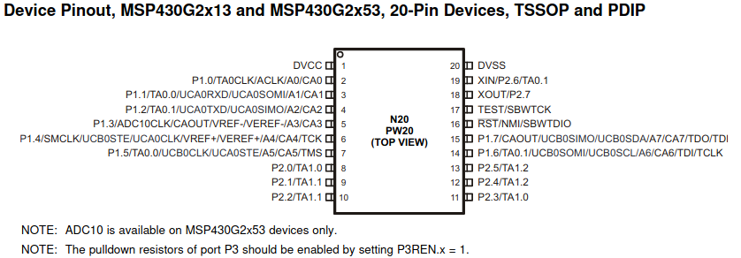

# msp430ref

Reference firmware for the MSP430G2553 (LaunchPad / G2 family): 
  - hardware PWM via Timer_A 
  - ADC10 in sequence mode. 
  
  ## Pin map:




## Aim of the firmware

The firmware provides a clean API for:

- **Hardware PWM channels** — `pwm.h`: `PWM_Configure(port, period)` once, then `PWM_SetDuty(port, duty_Q8)` at runtime. `SetPWMOut(...)` is kept as a one-shot wrapper. Supported `PWMPorts`: `P1_2`, `P1_6`, `P2_1`, `P2_2`, `P2_4`, `P2_5`, `P2_6`.
- **ADC inputs** — `adc.h`: `ConfigureADC(Ax)` can be called per channel; the driver accumulates the set and reprograms the ADC10 sequencer accordingly. `GetADCValue(Ax)` triggers a fresh sequence, waits for completion, and returns the 10-bit sample.
- **Flash-backed settings** — `flash.h`: `Flash_Init`, `Flash_EraseSegment`, `Flash_Write`, `Flash_Read` against INFOB/C/D (INFOA is left alone because it holds the DCO calibration). `main.c` uses `FLASH_INFOD` to persist PWM duties and period across resets, with a magic-word check to initialise defaults on first boot.


## Toolchain and build

The `Makefile` uses Texas Instruments MSP430 GCC (`msp430-elf-gcc`), not the older `msp430-gcc` from the Debian/Ubuntu `gcc-msp430` package. Adjust these variables to match your install:

| Variable | Purpose |
|----------|---------|
| `MSPGCC_ROOT_DIR` | Root of the TI `msp430-gcc` package (default in repo: `/Users/emil/ti/msp430-gcc`) |
| `MSPGCC_BIN_DIR` | Usually `$(MSPGCC_ROOT_DIR)/bin` |

Build artifacts go under `obj/` and `bin/`.

```bash
make all    # produces bin/main.elf
make clean
make debug  # runs mspdebug (see below) with bin/main.elf
```

The MCU is set in the Makefile as `msp430g2553` (`-mmcu=msp430g2553`).

## Flash and debug

Programming uses [mspdebug](https://dlbeer.co.nz/mspdebug/) with the `rf2500` driver (typical for the MSP-EXP430G2 LaunchPad’s on-board debugger). After `make all`:

```bash
./flash.sh
```

`flash.sh` programs `bin/main.elf`. The Makefile `debug` target also invokes `mspdebug rf2500` with that ELF.

## Application notes

- Add appropriate analog front-end (e.g. input filtering or a capacitor per channel) for stable ADC readings, per your hardware and the device datasheet.
- For smoother or load-friendly PWM, consider RC filtering or buffering on PWM outputs, depending on what you drive.

## Local documentation

PDFs under `docs/` (e.g. device and user guide) are included for offline reference.
